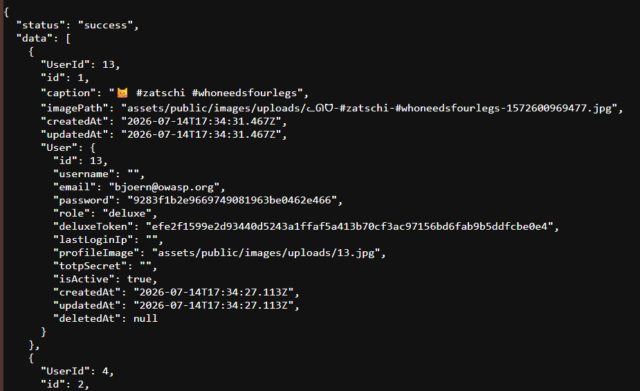

# OWASP Juice Shop notes and documentation

## User data returned in API repsonse

Findings:
Sensitive user data exposed in API repsonse.

Location:
Photo wall image upload request

Impact:
User information may be disclosed to unauthorised users

Evidence:
API repsonse contained user account information

Remediation:
Remove unnecessary sensitive fields from repsonse

